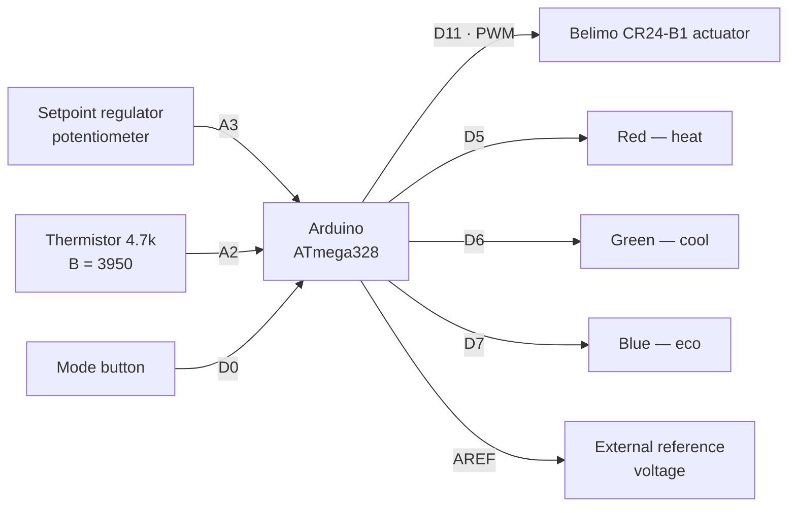

# Belimo room thermostat CR24-B1 — custom Arduino firmware

Arduino firmware that turns a **Belimo CR24-B1** room thermostat into a thermostat with
three operating modes and PWM control of the Belimo actuator.

## Features

- Three operating modes, switched by a button and stored in EEPROM:
  - **1 — heat** (red LED);
  - **2 — cool** (green LED);
  - **3 — eco** (blue LED, actuator fully closed).
- Setpoint is set by the "regulator" potentiometer on the thermostat panel: 19…25 °C.
- Temperature measurement with an NTC 4.7k thermistor (B = 3950), averaged over 5 samples.
- Three-step actuator control via PWM: 0 / 130 / 255.
- The active mode is restored from EEPROM after power-up.

## Hardware

### Pins

| Arduino pin | Name in code | Purpose |
| --- | --- | --- |
| D5 | `heat` | Red LED — "heat" mode indication |
| D6 | `cool` | Green LED — "cool" mode indication |
| D7 | `eko` | Blue LED — "eco" mode indication |
| D11 | `pwm` | PWM output to the Belimo actuator |
| D0 | `ButPin` | Mode button (see the notes below) |
| A2 | `THERMISTORPIN` | NTC 4.7k thermistor |
| A3 | `reg` | Setpoint regulator (potentiometer) |
| AREF | — | External reference voltage with `USE_EXTERNAL_AREF 1` |

### Wiring



## How it works

1. The position of the setpoint regulator is read from `reg` (A3) and mapped to a setpoint.
2. The thermistor (A2) is sampled `NUMSAMPLES` times, the readings are averaged, the ADC code
   is converted to resistance and then to temperature (°C) using the B-parameter equation.
3. While the button is pressed the mode cycles `1 → 2 → 3 → 1`, the indication is updated,
   and on release the new value is written to EEPROM.
4. The deviation between the measured temperature and the setpoint sets the actuator power
   through PWM on `pwm` (D11).

### Setpoint vs. regulator position

| ADC code (`reg`) | Setpoint |
| --- | --- |
| ≥ 1000 | 25 °C |
| 850…999 | 24 °C |
| 680…849 | 23 °C |
| 500…679 | 22 °C |
| 340…499 | 21 °C |
| 120…339 | 20 °C |
| < 120 | 19 °C |

Thresholds are tested from the highest to the lowest, so the whole regulator travel is
covered without gaps (in the original firmware the codes 11…119 left the setpoint unchanged).

### Actuator control algorithm

| Mode | Condition | PWM |
| --- | --- | --- |
| 1 — heat | `t ≥ setpoint − 0.5` | 0 |
| | `setpoint − 1.0 ≤ t < setpoint − 0.5` | 130 |
| | `t < setpoint − 1.0` | 255 |
| 2 — cool | `t ≤ setpoint + 0.5` | 0 |
| | `setpoint + 0.5 < t ≤ setpoint + 1.0` | 130 |
| | `t > setpoint + 1.0` | 255 |
| 3 — eco | always | 0 |

The PWM value is set explicitly on every loop iteration, so in eco mode the actuator is
guaranteed to be closed instead of holding the previous value.

## Building and flashing

The sketch is named `belimo.ino`, so the Arduino IDE expects a folder named `belimo`.
Copy the file into a folder named `belimo` (or rename the project folder) before opening it
in the IDE.

With [arduino-cli](https://arduino.github.io/arduino-cli/):

```bash
arduino-cli compile --fqbn arduino:avr:uno .
arduino-cli upload -p COM3 --fqbn arduino:avr:uno .
```

No external libraries are required — only the bundled `EEPROM` library is used.

## Firmware settings

All parameters are set with `#define` directives at the top of `belimo.ino`:

| Define | Default | Purpose |
| --- | --- | --- |
| `USE_EXTERNAL_AREF` | `1` | `1` — external reference voltage on AREF, `0` — internal (5 V) |
| `DEBUG_SERIAL` | `0` | `1` — print temperature, setpoint and mode to Serial (uses pins 0/1) |
| `BUTTON_PULLUP` | `0` | `0` — external pull-down to GND, pressed = `HIGH`; `1` — internal pull-up, pressed = `LOW` |
| `DEBOUNCE_MS` | `30` | button debounce time, ms |
| `SETTEMP_MIN` / `SETTEMP_MAX` | `19` / `25` | setpoint limits, °C |
| `HYST_HALF` / `HYST_FULL` | `0.5` / `1.0` | PWM step thresholds, °C |
| `MODE_DEFAULT` | `MODE_ECO` | mode used with a blank EEPROM (after the first flash) |

## Notes

- **Pin D0 is RX.** It shares the line with the UART, so an active button can interfere with
  flashing the sketch and with `Serial`. It is better to move the button to a free pin (for
  example `D2` or `A0`) and update `#define ButPin`. By default the firmware keeps the original
  wiring (button on D0, pressed = `HIGH`).
- If the board has no external pull-down for the button, enable `BUTTON_PULLUP 1` — the button
  must then short the pin to GND and the pressed level is `LOW`.
- `analogReference(EXTERNAL)` requires a reference voltage on AREF, otherwise the temperature
  readings will be wrong. With a regular 5 V supply set `USE_EXTERNAL_AREF 0`.
- The setpoint is not stored in EEPROM — it is read from the regulator on every start.
- EEPROM is written only when the mode actually changes, which extends the cell lifetime.

## Changes vs. the original version

- `#include <EEPROM.h>` is enabled (the sketch did not compile without it).
- The value read from EEPROM is validated: a blank EEPROM returns `0xFF` and previously left the
  thermostat in a state where no mode was active.
- Setpoint thresholds are collected in `setpointFromRegulator()` and the gaps between the ADC
  ranges are gone.
- Button debounce and an explicit pin mode (`INPUT` / `INPUT_PULLUP`) were added.
- PWM is now set explicitly on every loop iteration: in eco mode the actuator is closed instead
  of holding its last value.
- Magic numbers were replaced with named constants, the code was split into functions, and the
  comments now match the real pins (D5/D6/D7 instead of "port 13/12/11").

## License

This project is licensed under the [MIT](LICENSE) license.

Copyright (c) 2026 Shahidsamadov
